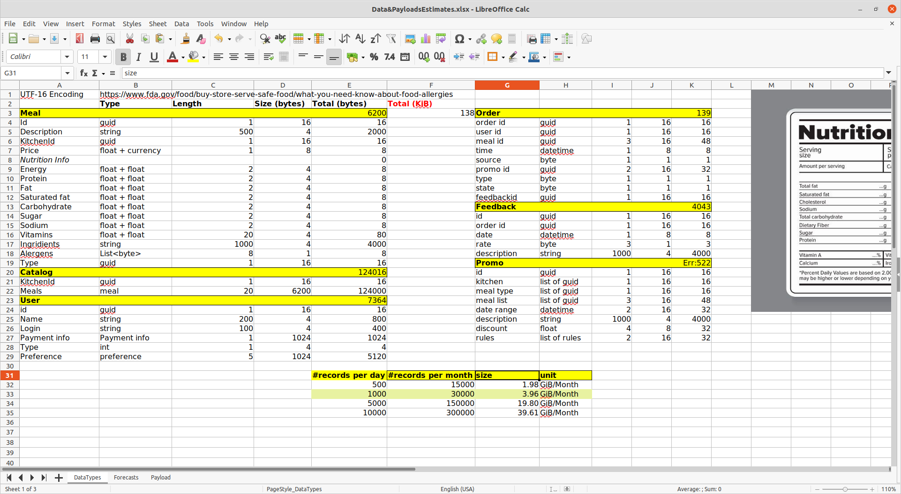
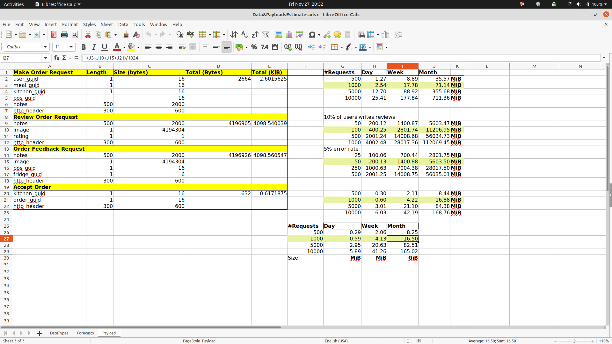

# Cost analysis considerations

[document](https://1drv.ms/x/s!AgHZ2TIcb18xgb0mmdVcv0yCnVXjFA)

## Introduction
While selecting infrastructure and third party systems, we were governed preliminary by costs of the solution and limited budget of the client. In rare cases we decided to pick more expensive solutions the reason for that was convenience of chosen service to exceed its monetary value.

## Caveat Emptor
Provided costs are estimated base on the list of assumption mentioned below and projection of user growth and traffic they might generate.
Assumptions:
- We estimate that Farmacy Food will reach 10K users

## Projections
### Database size
Below image illustrates few tables/documents that might be used in the solution -it's of course simplified model. Nevertheless, we can see that generating **30K** record per month (1000 records per day) will take around **3.96 GiB** of storage space. 

It's important to mention that this number is on the higher end of estimation because it assumes that the traffic to the application is distributed uniformly. In reality proposed number could be even 60% smaller than estimated **3.96 GiB**.

### Data transferr size (traffic)
Traffic forecast was calculated base on the most frequent requests to the application API. Because, Farmacy Food users will have the ability to write feedback and reviews we will provide them the ability to uploading images. We assume that image size will take 4 MiB. Furthermore, we expect that monthly only 10% of the users writes reviews and 5% of users have some problems that leads to sending a feedback. As we can see that for **1000** requests per day (30K per month) we'll end up transferring to our application around **16.5 GiB** of data, and storing around **16 GiB** of images per month. 

This estimates base on the assumption that traffic is uniformly distributes. Moreover, we don't use compression for HTTP requests and messaging request as well for images. While implementing the solution we would use appropriate compression algorithm such GZIP which is very efficient for text compression and good for image compression, therefore we could significantly lower the costs.

## Infrastructure

That chosen AWS region is us-east due to the location being the closest to Detroit which is currently the largest market.

This part only shows infrastructure elements that have costs attached.

| (Cloud or SaaS) service | Provider  |Description |
| ------------- | --------  |------------- |
| EC2           | AWS       |Instance of a   |
| Amazon MQ     | AWS       | Managed service the can provide Rabbit MQ [ADR 4](/4.ADRs/004 Tracing and Monitoring Sytem.md)  |
| Application Load Balancer | AWS  | Load balancer for services running inside AWS. |
| Amazon Cognito | AWS  | Authentication and Authorization provider. |
| DataDog | DataDog | Metric and Event aggregator |
| SNS     | AWS | Notification Service used for push notifications |
| Cognito | AWS |  |
| Route 53 | AWS | Certificates (TLS) and DNS routing. |
| S3 Buckets| AWS | Storage services |
| API Gateway | AWS | Incoming requests |
| Amazon DynamoDB| AWS | NoSQL database |
| CloudFormation| AWS | Infrastructure as code solution |

## Cost

* [DataDog](https://www.datadoghq.com/pricing/) $15 USD

## Estimated cost bandwith

### Summary

|Service| 1-year TCO at minimum | 1-year TCO at projected growth | 1-year TCO at rapid growth |
| ----- | --------------------- | ------------------------------ | -------------------------- |
| EC2   | | | |
| AMAZON MQ | | | |
| Application Load Balancer | | | |
|DataDog| | | |

## Scaling scenarios

