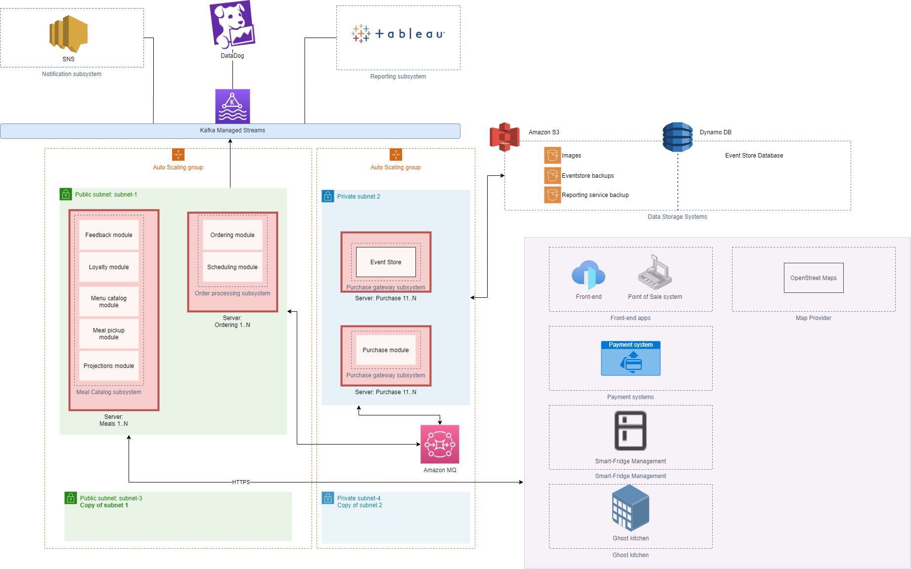

# Infrastructure Services and (virtual) hardware

Figure 1: Services overview

> **Note: ** The second subnet is a copy of subnet 1 when instanced from the Infrastructure as Code specification. Scaling can create more copies on-demand.

# Servers in the public subnets (subnet 1 and 3)
All servers in the public subnet are allowed to communicate internally and across subnets (including private subnets) using message queues. (_MQ_) Internal HTTPS traffic is allowed where applicable. (i.e. REST APIs)

External communication is either realized through a data stream that is picked up by log readers on the external end or through HTTPS communication.

Private subnets are only allowed to communicate within the _VPC_ or, using the appropriate channels, with _AWS_ services such as _S3_.

> All servers are **t3.medium** _EC2_ instances.

## Core server
<<<<<<< HEAD:3.ViewsAndPerspectives/infrastructure/Infrastructure-services-and-virtual-hardware.md
The software architecture is classed as a modular monolith. (See: [ADR 003: System approach](/4.ADRs/002%20System%20approach.md)) In Figure 1 we have used a single-core server as an example. Of course, this doesn't accurately represent the actual scaling of the systems but it serves to focus you to on the important bits for the purpose of this discussion.
=======
The software architecture is classed as a modular monolith. (See: [ADR 003: System approach](../../4.ADRs/002 System approach.md)) In Figure 1 we have used a single-core server as an example. Of course, this doesn't accurately represent the actual scaling of the systems but it serves to focus you to on the important bits for the purpose of this discussion.
>>>>>>> master:3.ViewsAndPerspectives/infrastructure/Infrastructure services and (virtual) hardware.md

> Servers in Figure 1 all represent templates of server instances.

## Ordering server
The ordering server hosts the ordering and scheduling modules contained in the order processing subsystem. 

## Event Store
The event-store is not available from the outside of the _VPC_. The scaling is done separately from the public subnet's scaling group.

## Amazon MQ (_MQ_)
As we have a modular monolith, we should treat the modules as if they were **not** part of a single monolith. Modules are allowed to "talk" to each other by using a message queue. We have decided on the use of _AMQ_ to provide us with such queue capabilities.

## Kafka Managed Streams (_Kafka_)[1](#footnotes)
Once again, we have chosen to use an _AWS_ native service for our streaming needs. This component of the infrastructure allows us to communicate beyond intra-module. We use this for notification requests, metrics export, and data reporting.

## Amazon Simple Notification Service (_SNS_)
_SNS_ is a notification service that serves as a facade for multiple notification options. The use of this service will allow us to send _SMS_ texts, e-mail, or mobile push messages when certain events occur. Examples of such events are:
- Meal is available for pick-up
- Customer-friendly messages for unexpected/undesirable conditions. (Meal out of stock, payment failed, etc.)

## DataDog
_DataDog_ is a _SaaS_ offering that lives outside of _AWS_. _DataDog_ is used to receive, analyze, and report on metrics provided by our systems. _DataDog_ is to be used as an aggregator of all our metrics data. (Exceptions may apply)

## Tableau
Reporting on user-generated data can be of vital importance to the company. Tableau is a well-known player in the reporting market and trusted by many companies. Tableau reports serve as a way to identify crucial pivot points for your company.

## External systems
In Figure 1 we have grouped some external systems. For the purpose of this discussion, they are only interesting from the communications channel perspective. We use HTTPS to communicate with a number of external systems. All channels **must** be secured.

## Footnotes
1: We use Kafka as an abbreviation (of sorts) here because _KMS_ is already a term used in _AWS_ and we believe this might cause confusion.
